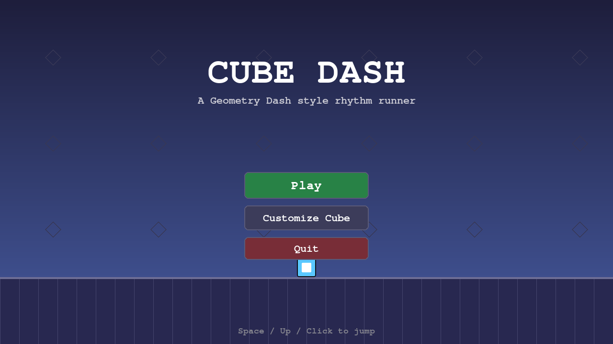

# Cube Dash

A Geometry Dash–style rhythm runner built with Python + pygame. Guide an
auto-running cube through a course of spikes, blocks, and jump pads — one tap at
a time — across **7 levels, each with its own original soundtrack**.



## Features

- **The Main Track — 7 levels / 7 songs.** Every level has its own
  procedurally-synthesized chiptune track, color theme, scroll speed, and
  difficulty (Stereo Sunrise → Final Circuit). No external/copyrighted audio:
  the music is generated from scratch at first launch and cached to `.gd_cache/`.
- **One-button gameplay.** Tap/hold **Space**, **Up/W**, or **click** to jump.
  Hold to auto-hop. Land on blocks, bounce off yellow pads, dodge the spikes.
- **Cube customization.** 8 icon shapes, a 12-color palette for both a primary
  and secondary color, and a toggleable motion trail. Your choices are saved.
- **Always-fair levels.** Each course is generated and then *proven beatable* by
  a built-in solver before you ever play it (with a guaranteed-clearable
  fallback), so no level is ever impossible.
- **Progress tracking.** Per-level best percentage, completion stars, and an
  attempt counter — all persisted between sessions in `gd_save.json`.

## Run it (desktop)

```bash
pip install -r requirements.txt
python main.py
```

> The 7 soundtracks ship pre-rendered as small OGG files in `assets/music/`, so
> startup is instant. If those assets are ever missing the game falls back to
> synthesizing WAVs on first launch. With no audio device it still runs silently.

## Play on mobile 📱

The game runs on phones/tablets through the browser via
[**pygbag**](https://github.com/pygame-web/pygbag), which compiles it to
WebAssembly. It's fully touch-playable — **tap and hold anywhere to jump**, with
on-screen **⏸ pause**, **Retry**, and **Levels** buttons (no keyboard needed).

```bash
pip install -r requirements-web.txt
pygbag main.py            # serves at http://localhost:8000
```

Then on your phone (same Wi-Fi) open `http://<your-computer-ip>:8000`. To deploy
publicly, build a static bundle and host it anywhere (e.g. GitHub Pages):

```bash
pygbag --build main.py    # outputs build/web/  (index.html + game bundle)
```

> Notes: landscape orientation plays best (the canvas auto-scales to fit).
> Progress/customization save to the browser's virtual storage for the session.

## Play it on a website 🌐

The repo ships a GitHub Actions workflow
([`.github/workflows/deploy-web.yml`](.github/workflows/deploy-web.yml)) that
builds the WebAssembly bundle and publishes it to **GitHub Pages** on every push
— giving you a public URL anyone can open on desktop or mobile, no install.

**One-time setup (required):** open the repo's **Settings → Pages**, and under
**Build and deployment → Source** choose **GitHub Actions**. (GitHub doesn't let
the Actions token turn Pages on by itself, so this single click is needed once.)
Then re-run the workflow from the **Actions** tab. The site goes live at:

```
https://<your-username>.github.io/<repo-name>/
```

The workflow's **Deploy** step prints the exact URL, and you can re-run it any
time from the **Actions** tab. Prefer another host? Build the bundle and upload
it anywhere static:

```bash
pygbag --build main.py     # -> build/web/  (drag onto Netlify/Vercel, etc.)
pygbag --archive main.py   # -> build/web.zip  (upload directly to itch.io)
```

## Controls

| Action            | Keyboard                     | Touch / Mouse            |
|-------------------|------------------------------|--------------------------|
| Jump              | `Space` / `Up` / `W`         | Tap & hold the screen    |
| Pause → levels    | `Esc`                        | **⏸** button (top-right) |
| Retry (on death)  | `Space`                      | **Retry** button         |
| Back to levels    | `Esc`                        | **Levels** button        |

## Project layout

| File         | Responsibility                                            |
|--------------|-----------------------------------------------------------|
| `main.py`    | Async entry point + game loop (desktop **and** pygbag/web) |
| `game.py`    | State machine: title, level select, customize, play       |
| `level.py`   | Self-validating obstacle generator + level model          |
| `solver.py`  | DFS beatability checker used to validate levels           |
| `player.py`  | The cube: physics, collision, death, rendering            |
| `scene.py`   | Background, ground, and obstacle rendering                |
| `cubes.py`   | Customization palettes, icon shapes, and cube renderer    |
| `music.py`   | Procedural chiptune synthesizer + the 7 song definitions  |
| `camera.py`  | Horizontal scrolling camera                               |
| `menu.py`    | Reusable UI widgets (buttons, fonts)                      |
| `save.py`    | Persistent save data (customization, unlocks, bests)      |
| `config.py`  | Tunable constants (display, physics, colors)              |
| `assets/music/` | Pre-rendered OGG soundtracks bundled with the game     |
| `tools/render_music.py` | Re-renders the OGG soundtracks (build-time)    |
